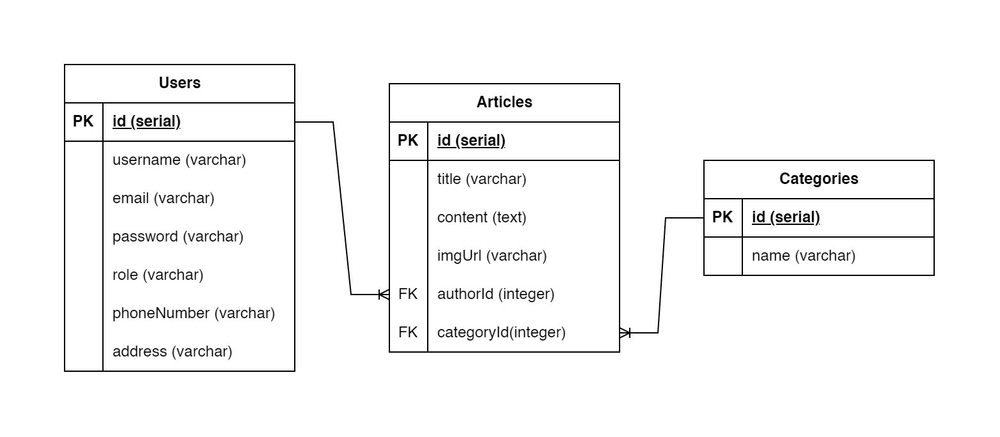

# News API Documentation

## Entity Relationship Diagram (ERD)


## Endpoint
- POST /articles
- GET /articles
- GET /articles/:id
- DELETE /articles/:id
- GET /categories
- POST /register
- POST /login

## 1. POST /articles 
- Description : create a new article

### Request 
- request headers
```json
{
  "access_token": "eyJhbGciOiJIUzI1NiIsInR5cCI6IkpXVCJ9.eyJpZCI6MTIsImlh"
}
 ```

- request body
```json
{
  "title": "praesent blandit lacinia erat vestibulum sed magna at nunc commodo placerat praesent",
  "content": "Donec diam neque, vestibulum eget, vulputate ut, ultrices vel, augue. Vestibulum ante ipsum primis in faucibus orci luctus et ultrices posuere cubilia Curae; Donec pharetra, magna vestibulum aliquet ultrices.",
  "imgUrl": "http://dummyimage.com/233x100.png/5fa2dd/ffffff",
  "authorId": 1,
  "categoryId": 6
}
 ```

### Response
- Response (201) - Success created an article
 ```json
{
  "message": "Success create article",
  "data": {
    "title": "praesent blandit lacinia erat vestibulum sed magna at nunc commodo placerat praesent",
    "content": "Donec diam neque, vestibulum eget, vulputate ut, ultrices vel, augue. Vestibulum ante ipsum primis in faucibus orci luctus et ultrices posuere cubilia Curae; Donec pharetra, magna vestibulum aliquet ultrices.",
    "imgUrl": "http://dummyimage.com/233x100.png/5fa2dd/ffffff",
    "authorId": 1,
    "categoryId": 6
  }
}
```

- Response (400) - Failed created an article
```json
{
  "message" : "Title is required"
}
OR
{
  "message" : "Content is required"
}
OR
{
  "message" : "Author is required"
}
OR
{
  "message" : "Category is required"
}
```

## 2. GET /articles 
- Description : get all articles

### Request 
- request headers
```json
{
  "access_token": "eyJhbGciOiJIUzI1NiIsInR5cCI6IkpXVCJ9.eyJpZCI6MTIsImlh"
}
 ```
 
### Response
- Response (200) - Success get data articles
 ```json
{
  "message": "Success get data",
  "data": [
    {
      "title": "praesent blandit lacinia erat vestibulum sed magna at nunc commodo placerat praesent",
      "content": "Donec diam neque, vestibulum eget, vulputate ut, ultrices vel, augue. Vestibulum ante ipsum primis in faucibus orci luctus et ultrices posuere cubilia Curae; Donec pharetra, magna vestibulum aliquet ultrices.",
      "imgUrl": "http://dummyimage.com/233x100.png/5fa2dd/ffffff",
      "authorId": 1,
      "categoryId": 6,
      "Author": {
        "username": "mbartolomeu0",
        "email": "znester0@blogspot.com"
      },
      "Category": {
        "name": "Politics"
      }
    },
    {
      "title": "a pede posuere nonummy integer non velit donec diam neque vestibulum eget vulputate ut ltrices vel",
      "content": "Praesent id massa id nisl venenatis lacinia. Aenean sit amet justo. Morbi ut odio.\n\nCras mi pede, malesuada in, imperdiet et, commodo vulputate, justo. In blandit ultrices enim. Lorem ipsum dolor sit amet, consectetuer adipiscing elit.\n\nProin interdum mauris non ligula pellentesque ultrices. Phasellus id sapien in sapien iaculis congue.",
      "imgUrl": "http://dummyimage.com/233x100.png/5fa2dd/ffffff",
      "authorId": 2,
      "categoryId": 3,
      "Author": {
        "username": "twestberg1",
        "email": "jbourke1@seesaa.net"
      },
      "Category": {
        "name": "Entertainment"
      }
   },
  ...
  ]
}
```

## 3. GET /articles/:id
- Description : get an article by id

### Request 
- request headers
```json
{
  "access_token": "eyJhbGciOiJIUzI1NiIsInR5cCI6IkpXVCJ9.eyJpZCI6MTIsImlh"
}
 ```

### Response
- Response (200) - Success get an article
 ```json
{
  "message": "Success get data",
  "data": {
    "title": "praesent blandit lacinia erat vestibulum sed magna at nunc commodo placerat praesent",
    "content": "Donec diam neque, vestibulum eget, vulputate ut, ultrices vel, augue. Vestibulum ante ipsum primis in faucibus orci luctus et ultrices posuere cubilia Curae; Donec pharetra, magna vestibulum aliquet ultrices.",
    "imgUrl": "http://dummyimage.com/233x100.png/5fa2dd/ffffff",
    "authorId": 1,
    "categoryId": 6,
    "Author": {
      "username": "mbartolomeu0",
      "email": "znester0@blogspot.com"
    },
    "Category": {
      "name": "Politics"
    }
  }  
}
```

- Response (404) - Article not found
```json
{
  "message" : "Data is not found"
}
```

## 4. DELETE /articles/:id
- Description : Delete an article by id

### Request 
- request headers
```json
{
  "access_token": "eyJhbGciOiJIUzI1NiIsInR5cCI6IkpXVCJ9.eyJpZCI6MTIsImlh"
}
 ```

### Response
- Response (200) - Success delete article
 ```json
{
  "message": "Article succcess to delete",
  "data": {
    "title": "praesent blandit lacinia erat vestibulum sed magna at nunc commodo placerat praesent",
    "content": "Donec diam neque, vestibulum eget, vulputate ut, ultrices vel, augue. Vestibulum ante ipsum primis in faucibus orci luctus et ultrices posuere cubilia Curae; Donec pharetra, magna vestibulum aliquet ultrices.",
    "imgUrl": "http://dummyimage.com/233x100.png/5fa2dd/ffffff",
    "authorId": 1,
    "categoryId": 6
  }  
}
```

- Response (403) - Forbidden
```json
{
    "message": "You are not authorized"
}
```

- Response (404) - Article not found
```json
{
  "message" : "Data is not found"
}
```

## 5. GET /categories 
- Description : get all categories

### Request 
- request headers
```json
{
  "access_token": "eyJhbGciOiJIUzI1NiIsInR5cCI6IkpXVCJ9.eyJpZCI6MTIsImlh"
}
 ```

### Response
- Response (200) - Success get data categories
 ```json
{
  "message": "Success get data",
  "data": [
    {
      "name": "Politics"
    },
    {
      "name": "Sports"
    },
    {
      "name": "Entertainment"
    },
  ...
  ]
}
```

## 6. POST /register 
- Description : create a new user account

### Request 
- request body
```json
{
  "username": "admintest",
  "email": "admin@test.com",
  "password": "admintest"
}
 ```
### Response
- Response (200) - Success get data categories
 ```json
{
    "message": "Success registered user",
    "data": {
        "id": 11,
        "email": "admin@test.com",
        "username": "admintest"
    }
}
```

- Response (400) - Failed create account
 ```json
{
    "message": "Username is required"
}
OR
{
    "message": "Email is required"
}
OR
{
    "message": "Password is required"
}
```

## 6. POST /login 
- Description : login the user with their account

### Response
- Response (200) - Success get data categories
 ```json
{
    "message": "Success registered user",
    "data": {
        "id": 11,
        "email": "admin@test.com",
        "username": "admintest"
    }
}
```
- Response (400) - Failed login because of empty input
 ```json
{
    "message": "Email / password is required"
}
```

- Response (401) - Invalid user credentials
 ```json
{
    "message": "Email / password is incorrect"
}
```

## Global Errors

- Response (401) - Unauthenticated
```json
{
    "message": "Unauthenticated"
}
```

- Response (500) - Internal Server Error
```json
{
  "message" : "Internal Server Error"
}
```